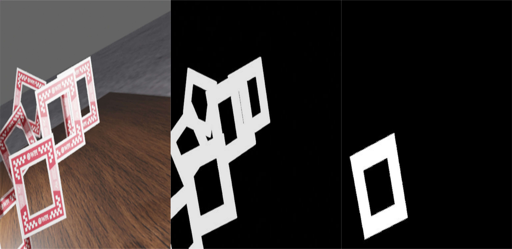
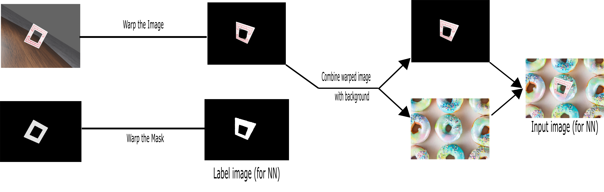
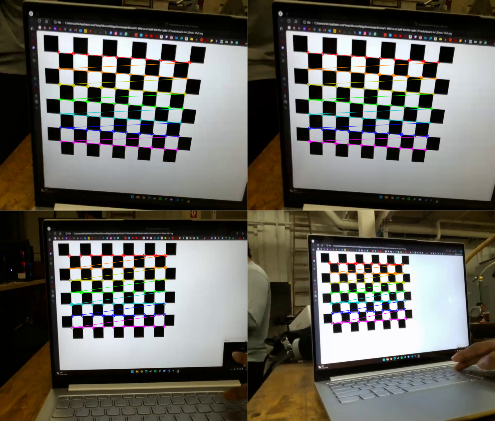

# Mini Drone Race – The Perception Saga!
- In this project, a perception stack for DJI Tello EDU quadcopter was developed to enable precise navigation through multiple windows, whose texture and approximate dimensions are known.
- To achieve this, simulation-to-reality (sim2real) techniques (such as domain randomization) were used to generate synthetic data from blender, creating a robust training set images and labels for the neural network model.
- YOLOv8 was the chosen architecture model and it was trained to identify and segment the front window from a complex environment of multiple windows.
- Once the segmentation mask was detected, the corners were extracted and a Perspective-n-Point (PnP) algorithm is applied to calculate the relative pose of the front window which is essential for guiding the quadcopter through the windows safely.\
(Check the full problem statements here [project3a](https://rbe549.github.io/rbe595/fall2023/proj/p3a/) and [project3b](https://rbe549.github.io/rbe595/fall2023/proj/p3b/))
## Steps to run the code
- Install Numpy, Scipy, Matplotlib, blender python, pyquaternion, djitellopy, OpenCv, Ultralytics libraries before running the code.
- Data generation:
  - If you want to use the dataset we generated, download it from this [link](https://drive.google.com/file/d/1vpTFZ2e7NAu6Ufwol3CPBNRqSzk6DJaQ/view?usp=sharing) (NOTE: size is nearly 4GB).
-  Training:
    - To train the YOLOv8 model run the `window_seg_yolov8.ipynb` file in `YOLO Model` folder and before doing that add the location to your dataset appropriately.
    - You can also use the already trained weights that gave an inference time of 33ms on Orin nano. The weights file `last.pt` is in `YOLO Model` folder. 
- Camera Calibration: Use the code in `Calibration` folder to get the camera intrinsics and distortion coefficients.
- To fly the drone (no need to do any of the above steps for doing this step):
	- Set up the tello drone and NVIDIA Jetson Orin nano
   	- On orin nano clone this repository
   	- Open the `fly_tello.py` file.
   	- Connect to the network of the tello drone and run in `repo` folder the following command:
   	  ```
	    python3 fly_tello.py
	    ```

## Report
For detailed description see the report [here](Report.pdf).
## Plots and Animations
### Data generated:
A sample set of images and labels generated from blender:
<p float="middle">

</p>

### Data Augmentation pipeline:
The generated images are augmented using the following pipeline to create more diverse data.
<p float="middle">

</p>

### Camera Calibration:
After proper camera calibration on the checkerboard.
<p float="middle">

</p>

### Results:
The network prediction masks, corner inference, and pose estimated for a sample set of frames.
<p float="middle">
	 
	
</p>

### Deployment on the real drone:
Watch the test run on the real tello drone here ([link1](https://youtu.be/WQvOlGGIvAI) and [link2](https://youtu.be/lSRwmYc5FLc)).
<p float="middle">
	 
	
</p>


## Collaborators
Chaitanya Sriram Gaddipati - cgaddipati@wpi.edu

Shiva Surya Lolla - slolla@wpi.edu

Ankit Talele - amtalele@wpi.edu

